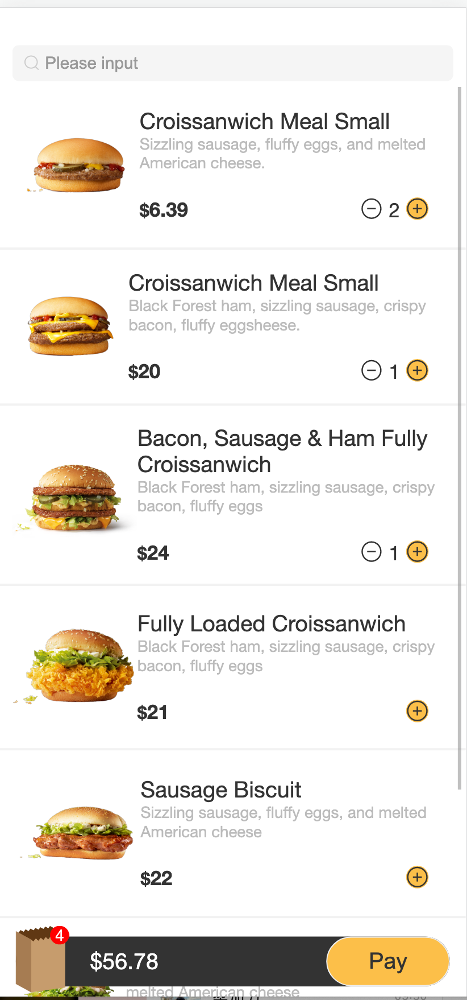
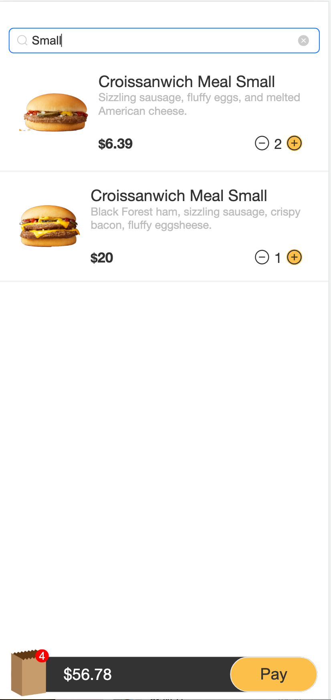
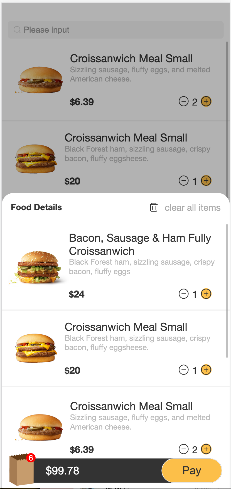
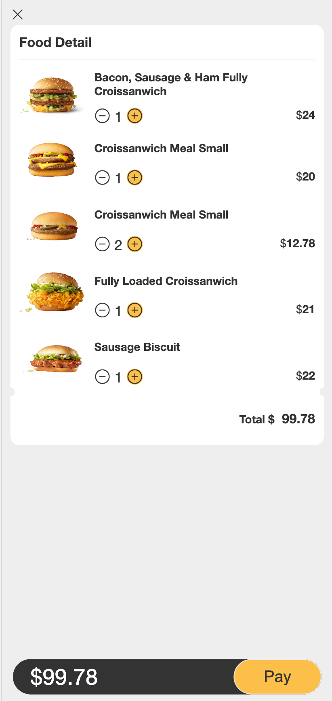
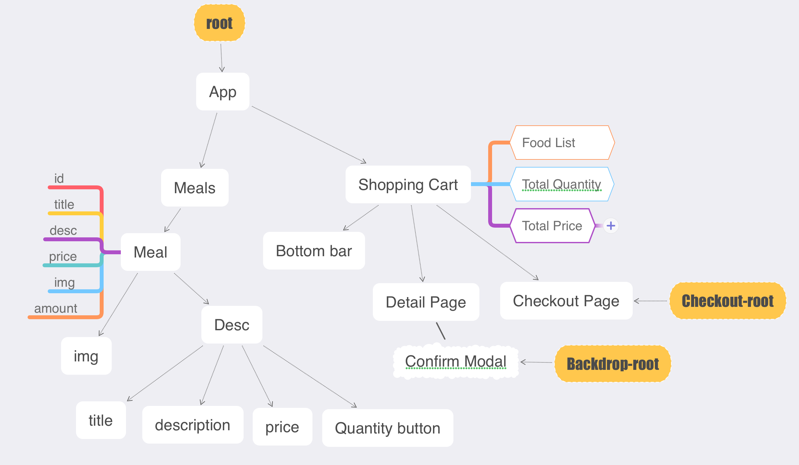

# App for ordering food 

1. Add the food list component
   - add +/- button
2. Add search bar
   - use keyword to filter food list

3. Add bottem bar
   - show total quantity of selected food, total price and pay button.
   - disabled mode is triggered when there is no selection of food.
   - when the cart is non-empty, a detail page will pop up when the bar is hit.
   - when pay button is clicked, a separate checkout page will appear.

### Food list page &darr;

### Search page &darr;

### Cart detail Page &darr;

### checkout page &darr;

## Lessons learned
  - Use *rem* as the unit of font-size, instead of *px*
  - Use *useContext* to populize cart data across different components.
  - Use backdrop under a different root to improve app's maintenance and scalability.
  - a design flow chart is below:

## Future directions
  - When cart is empty both on the cart page or the checkout page, the cart is supposed to automatically vanish, but I haven't resolved this issue.
  

